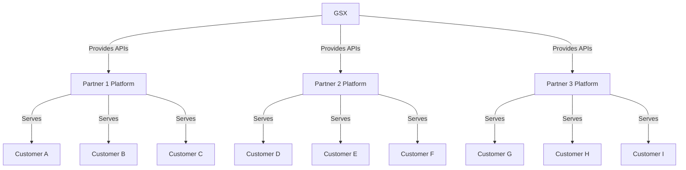
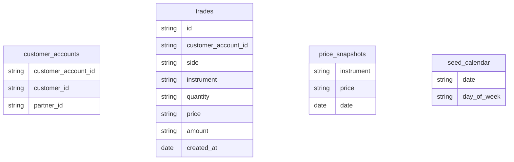
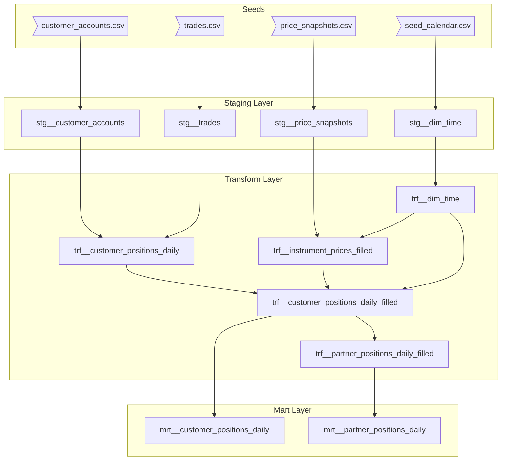
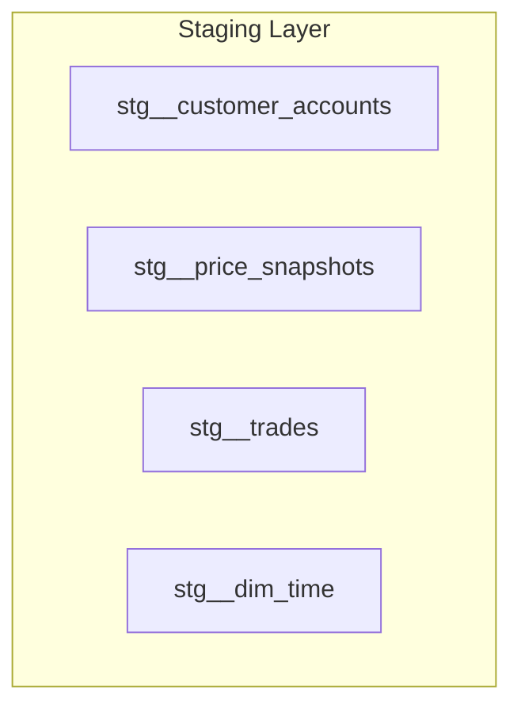
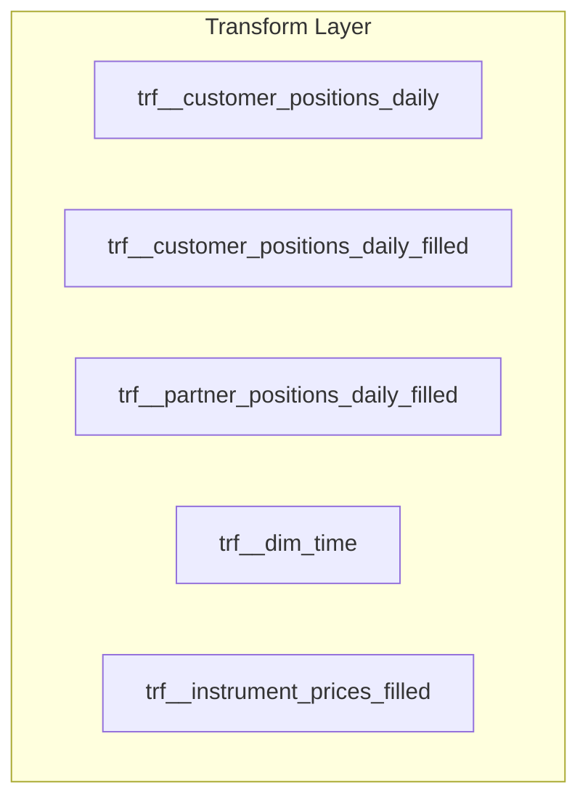
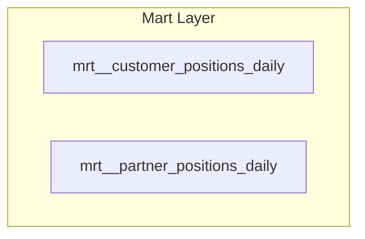
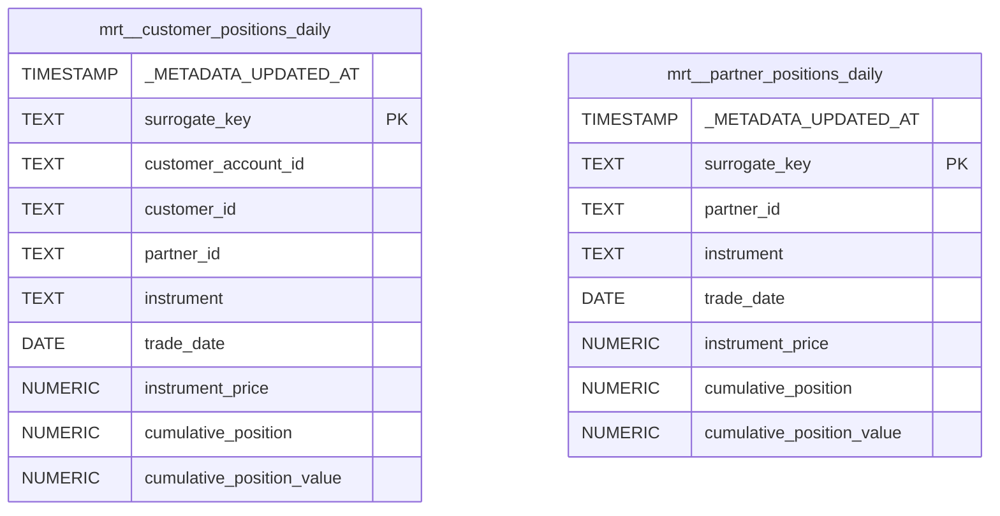

# Analytics Engineer Case Study



<br>
<br>

**GSX** is a platform that provides infrastructure and APIs to partners (brokers), who then serve to their customers.


### Project Overview

In this project, I addressed a common challenge faced by investment platforms: tracking the daily evolution of customer positions, including non-trading days, and aggregating this information at the partner level to monitor total Assets under Custody (AuC).

The main objective was to gain insight into how customer portfolios evolve over time—both in terms of the number of positions held and their corresponding total value. To achieve this, I built a data pipeline that captures daily portfolio dynamics, ensuring complete temporal coverage—including non-trading days.

### Input Data and Schema

This repository includes seed files that populate the following core tables: Customer Accounts, Trades, and Instrument Price Snapshots. Additionally, a custom calendar seed was generated using a [`Python script`](python_scripts/calendar_script.py) to provide a complete date spine, including dates and their corresponding day of the week.


The project starts with 4 tables, as illustrated below:
<br>



### Table Descriptions

**customer_accounts:**
- `customer_account_id`: Unique identifier for the customer's account.
- `customer_id`: Unique identifier for the customer.
- `partner_id`: Identifier for the partner where the customer is registered.

**trades:**
- `id`: Unique identifier for each trade.
- `customer_account_id`: Identifier of the customer's account that executed the trade.
- `side`: Indicates the trade direction (buy or sell).
- `instrument`: ISIN (International Securities Identification Number) of the traded instrument.
- `quantity`: Number of shares traded.
- `price`: Price per share at the time of the trade.
- `amount`: Total value of the trade (calculated as quantity × price).
- `created_at`: Timestamp of when the trade occurred.

**price_snapshots:**
- `instrument`: ISIN of the instrument.
- `price`: Price of the instrument at the time of the snapshot.
- `date`: Date when the price snapshot was recorded.

### Fractional and Monetary Values

Values in SQL are stored as strings and must be parsed. To avoid floating point issues, we use a structured format:
* For fractional values: (amount, scale)
  - Actual value = amount / 10^(scale)
* For monetary values: (amount, scale, currency)
  - Actual value = amount / 10^(scale) + currency

Examples:
* (9412,2,EUR) = 94.12 EUR
* (100,2,EUR) = 1.00 EUR
* (100,0,EUR) = 100 EUR
* (-3,3) = -0.003


### List of Tasks

1. **Parse Monetary and Fractional Values**
   Implement a suitable method to parse monetary and fractional values, considering the following format:
   - **Fractional values:** (amount, scale) → amount / 10^(scale)
   - **Monetary values:** (amount, scale, currency) → amount / 10^(scale) with currency code.

2. **Create two Trade Tracking Models**
   Build two models to track trades and calculate how positions and portfolio value change over time. The models should include:
   - **Customer-level metrics:**
     - Number of positions held per instrument.
     - Total value of positions held per instrument.
   - **Partner-level metrics:**
     - Number of positions held per instrument.
     - Total value of positions held per instrument.

3. **Ensure Sequential Dates**
   The model must cover all dates from the first trade to the last trade, including non-trading days. For dates without trades, fill in with the last known values.

4. **Testing**
   Include both data tests and unit tests for your models. Testing and data quality are critical to this task.

## Project Structure

The proposed solution is a **modular and consistent dbt pipeline** that ingests, cleans, and models the data following dbt best practices.

The pipeline is composed by 3 layers: staging, transform and mart each with a clearly defined purpose:

- **Staging Layer:** Loads raw data from the source, applies minimal transformations such as type casting, deduplication, and basic cleaning to ensure data quality.

- **Transform Layer:** Applies business logic, fills missing dates, calculates cumulative positions, enriches data with price information, and prepares it for final consumption.

- **Mart Layer:** Provides clean, rounded, and ready-to-use tables for analytics and reporting.


In addition to the three modeling layers, the pipeline includes also:

- **Macros:** Utility macros are used to parsi fractional and monetary values coming from the external sources.

- **Tests:** Set of tests validate data integrity at every stage, including uniqueness, non-nullness, value acceptance, date completeness, and sequential order. Custom tests are implemented under `tests/` directory to validate the required business logic.

- **Documentation:** All models are documented using dbt's docs feature.

<br><br>

The structure of the pipeline is the following:

<br>


<br>

**The final 2 final models cover the customer-level and partner-level metrics required:**

- [`mrt__customer_positions_daily`](models/mart/mrt__customer_positions_daily.sql)

Tracks the number of positions held per instrument and the total value of positions for each individual customer account, on a daily basis


- [`mrt__partner_positions_daily`](models/mart/mrt__partner_positions_daily.sql)

Aggregates the number of positions held and the total portfolio value per instrument at the partner level, also with daily granularity.

<br>
<hr>
<br>

1. **Coding conventions**

The code attempts to adhere to dbt conventions, with other guidelines, to be
more robust and easy to follow:

- Start with simple select CTEs → CTEs with transformations → end with
simple select

- Explicitly define selected columns, avoid * except in the staging layer,
where <code>SELECT *</code> is used in the first CTE of the models to pull in all data from
the sources.

- Explicitly define columns in group by or order by, avoid <code>group by 1,2</code> or <code>group by
all</code>.

- Indicate values for boolean conditionals <code>WHERE is_driver</code> → <code>WHERE is_driver = TRUE</code>

<br><br>

2. **Assumptions**

To complete the case study, I have made the following assumptions:

- Short positions (negative cumulative positions) are allowed, meaning customers can sell instruments they don't own.

- The price snapshots do not necessarily exist for every instrument on every day. Therefore, when modeling, the most recent available price up to the trade date is considered. If no price is available for a given instrument and date, the latest known price is carried forward to fill the gap. If no price snapshot exists for an instrument on a given day, we assume the price remains unchanged from the latest available snapshot prior to that day.

- The trades dataset is assumed to be consistent and includes only valid instruments that exist in the price snapshots dataset.


<br><br>

### 3. Layered Architecture


#### Staging Layer

<br>



<br>

- This layer ingests the raw seed data (`customer_accounts.csv`, `trades.csv`, `price_snapshots.csv` and `seed_calendar.csv`) and applies minimal transformations.
  
- Specifically:
  - Casts external source columns to appropriate types (e.g., `TEXT` for IDs, `DATE` for timestamps, `NUMERIC` for prices).
  - Deduplicates entries where necessary (e.g., prices are deduplicated per instrument and date).
  - Preserves all raw data without applying any business logic yet.
  - Explicitly defines selected columns after the initial `SELECT *` in the source CTE for clarity and control.
  - Uses macro ([`parse_fractional_values`](macros/parse_fractional_values.sql) to standardize and sanitize fractional numeric inputs.

 

- Models involved:

    - [`stg__customer_accounts`](models/staging/stg__customer_accounts.sql)
    
    Loads and lightly cleanses customer account data from the external source, casting types and ensuring uniqueness

    - [`stg__price_snapshots`](models/staging/stg__price_snapshots.sql)
    
    Loads instrument price snapshots, deduplicates records by instrument and date, and ensures price fields are numeric.

    - [`stg__trades`](models/staging/stg__trades.sql)
  
    Loads customer trades, parses monetary and fractional values, and prepares the data for position calculations.

    - [`stg__dim_time`](models/staging/stg__dim_time.sql)

    Loads calendar dates and week days and cast them as date and string respectively.


#### Transform Layer




<br>

- This layer contains the **core business logic** of the pipeline.
  
- Specifically:
  - Calculates the **daily cumulative position** of each customer per instrument, based on their trading activity (`buy` and `sell` transactions).
  - Dynamically generates a complete **date calendar** between the earliest and latest trade dates to avoid missing data points.
  - **Cross joins** customers and instruments with the complete calendar to fill missing days.
  - **Forward-fills** cumulative positions where there is no trading activity.
  - Joins price information from snapshots and fills missing prices using the latest available snapshot.
  - Calculates the **cumulative position value** (cumulative position × instrument price) on each day.

- Models involved:
  - [`trf__customer_positions_daily`](models/transform/trf__customer_positions_daily.sql)

  Captures the daily cumulative position per customer and instrument, but only on trading days (no forward filling yet).

  - [`trf__dim_time`](models/transform/trf__dim_time.sql)

  Produces a filtered calendar table that spans from the earliest to the latest trading date present in the dataset.

  - [`trf__instrument_prices_filled`](models/transform/trf__instrument_prices_filled.sql)

  Fills missing instrument prices by carrying forward the latest known snapshot, as explained in the assumptions.

  - [`trf__customer_positions_daily_filled`](models/transform/trf__customer_positions_daily_filled.sql)

  Expands customer positions to all dates by forward-filling both cumulative positions and corresponding instrument prices.

  - [`trf__partner_positions_daily_filled`](models/transform/trf__partner_positions_daily_filled.sql)

  Aggregates customer-level filled positions to the partner level, providing a daily view of partner portfolios.

  <br>

- **All models in this layer are materialized as views** in order to keep the layer lightweight and modular without duplicating storage unnecessarily. 


#### Mart Layer




- This layer finalizes the data to make it **ready for analytics and reporting** by consumers such as BI tools.
  
- Specifically:
  - Selects and rounds the numeric fields (position, instrument price, cumulative value) to **6 decimal places** for better precision and visualization.
  - Adds metadata fields (`_METADATA_UPDATED_AT`) for data freshness tracking.

- Models involved:
  - [`mrt__customer_positions_daily`](models/mart/mrt__customer_positions_daily.sql)
  - [`mrt__partner_positions_daily`](models/mart/mrt__partner_positions_daily.sql)


<br>

**The final datasets can be found in the `data` folder**

<br>

Structure of the mart models:


<br>

<br>

### Testing Strategy

A comprehensive suite of data and custom tests ensures the pipeline’s reliability and consistency:

- **Temporal completeness**: Verifies no missing days across the entire date range for each customer and partner.
- **Sequential logic**: Ensures time series continuity using window functions and cross joins.
- **Value consistency**: Compares intermediate models with final mart outputs to confirm transformation accuracy.
- **Data integrity**: Validates that all instruments traded exist in the price snapshot data and that all prices are strictly positive.

All custom tests are implemented in the [`tests/`](tests/) directory.


### How to run the project

To run this project locally:


1. Run Postgres locally using Docker Compose:

```console
$ docker-compose up -d
```

2. Set Up dbt CLI Environment

```console
$ python3 -m venv venv
$ source venv/bin/activate
$ pip install -r requirements.txt
```

3. Install dependencies
```bash
pip install -r requirements.txt
```

4. Run dbt seed
```bash
dbt seed
```
5. Run the the pipeline
```bash
dbt build
```